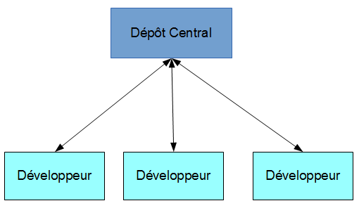
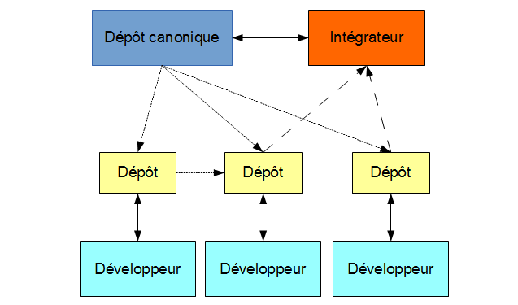
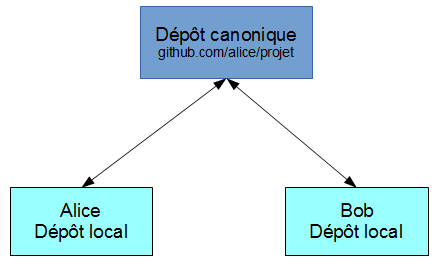
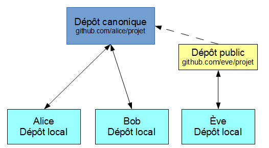
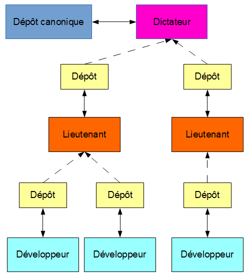

# Présentation d'un rapport technique sur le logiciel de gestion de versions décentralisé Git

### Par Justin Duplessis

#### Document basé sur la [documentation officielle Git](http://git-scm.com/doc), la [documentation Atlassin](https://www.atlassian.com/fr/git/tutorial/) et [l'encyclopédie libre Wikipédia](https://wikipedia.org) en Mars 2014

#### Publié sous la licence Creative Commons CC BY-NC-SA 4.0 
 
###### Version du document: 0.0.3

---

## Table des matières {.bg-primary}

1. [Qu'est qu'un logiciel de gestion de versions ?](#whatis)
    * [Centralisé](#centralise)
    * [Décentralisé](#decentralise)
    * [Local](#local)
2. [Fonctionnement de Git](#git)
    * [Les instantanés VS différences](#snapshots)
    * [Contrôle de l'intégrité](#hash)
    * [Communication entre les dépôts](#github)
    * [Développement hiérarchique](#dictator)
3. [Les trois états des fichiers]/(#stages)
    * [Répertoire de travail / Working directory]/(#edited)
    * [Zone d'index / Staging]/(#staged)
    * [Méta-données / Commit]/(#commited)
5. [Utilisation de Git]/(#usage)
    * [Initialiser un environnement]/(#initclone)
        * [Cloner]/(#clone)
        * [Créer]/(#init)
    * [Travailler avec les instantanés]/(#commits)
        * [Ajouter des fichiers aux modifications]/(#stage)
        * [Enlever des modifications locales]/(#unstage)
        * [Enregistrer les modifications]/(#commit)
        * [Annuler les modifications publiques]/(#revert)
        * [Obtenir une ancienne version]/(#checkout-commit)
        * [Comparer les modifications]/(#diff)
        * [Ignorer des fichiers]/(#gitignore)
    * [Travailler avec les branches]/(#branches)
        * [Créer une nouvelle branche]/(#branch)
        * [Changer de branche]/(#checkout)
        * [Fusionner des branches]/(#merge)
6. [Branches distantes]/(#online)
    * [Ajouter un dépôt distant](#remotes)
    * [Pousser]/(#push)
    * [Synchroniser]/(#pull)
    * [Effacer une branche distante]/(#delete-branch)
7. [Gérer les problèmes dans le code]/(#debug)
    * [Annotations]/(#blame)
    * [Recherche dichotomique d'un bogue]/(#bisect)

---
    
## 1. Qu'est qu'un logiciel de gestion de versions ? {#whatis}

Un logiciel de gestion de versions est un logiciel qui gère et conserve un ensemble de fichier et de leurs différentes versions à travers le temps dans une arborescence que l'ont appel dépôt.
L'utilisation des logiciels de version est surtout utilisé pour gérer du code source, mais peut s'appliquer à d'autres utilisations.

Le but visé est de garder un historique des modifications et les informations relatives aux changements apportés (qui, quand, où, pourquoi).
La plupart des gestionnaires de versions fournissent des outils afin de comparer les fichiers à leur différent niveau de développement et permettent de restaurer les anciennes versions en intégralité.

Il existe principalement 3 types de gestionnaires de versions:

* Centralisé
* Décentralisé
* Local

La majeure différence des gestionnaire de versions se fait sur la manière donc les clients enregistrent leurs modifications dans le dépôt et peut fortement affecter le processus de développement si le gestionnaire de versions n'est pas adapté.

Ce document a pour buts de démontrer l'utilisation du gestionnaire de versions Git et comparer en quoi certaines alternatives peuvent handicaper le processus de développement.

---

### Centralisé {#centralise}
Un logiciel de gestion de versions centralisé enregistre le dépôt à un seul endroit et les client n'ont que le minimum sur leur poste.

Un gestionnaire de versions centralisé **requiert donc un serveur** qui a comme rôle de conserver l'arborescence et ses modifications et d'interagir avec les clients afin d'enregistrer de nouvelles modifications et distribuer l'arborescence.

Toutes les opérations relatives aux branches et aux consignations ne peuvent être enregistrées qu'avec une connexion au serveur.
Dans le cas d'une panne, les utilisateurs **ne peuvent pas** aller chercher d'anciennes modifications ni en enregistrer de nouvelles car ils n'ont que leur version courante des fichiers.

{.center-block}

**Exemple de logiciels**

Subversion (SVN) de la fondation Apache et Team Foundation Server (TFS) de Microsoft sont de bons exemples de logiciels de gestion de versions centralisés encore beaucoup utilisés.

---

### Décentralisé {#decentralise}

Un gestionnaire de versions décentralisé **ne requiert pas** de serveur central car chaque client a l'entièreté des données relatives à l'arborescence ainsi que ses modifications.

Toutes les opérations relatives aux consignations et aux branches sont traités localement par le gestionnaire de versions installé. Ensuite, le développeur peut décider de publier sur un [dépôt canonique](#canonique) ses modifications.

Il est à noter que le dépôt canonique et les dépôts clients vont avoir exactement les mêmes données une fois synchronisés.
Si le dépôt canonique est inaccessible, les utilisateurs peuvent tout de même enregistrer des modifications sur leur poste et les envoyer plus tard au dépôt.

Les gestionnaires de versions décentralisés permettent un **développement hiérarchique**, une technique qui est beaucoup plus difficile à atteindre avec un logiciel centralisé.

Voici un exemple de 3 développeurs qui [poussent](#push) chacun sur un dépôt public des modifications de codes.
Le développeur du milieu décide d'intégrer les changements du développeur de gauche dans son dépôt public avec une [synchronisation](#pull) et demandent à un intégrateur de synchroniser le [dépôt canonique](#canonique) avec les modifications de son dépôt public.
Le développeur de droite pousse lui aussi ses modifications sur son dépôt public et demande à l'intégrateur d'inclure ses changements comme l'autre développeur.
L'intégrateur a alors le choix d'accepter les [demandes de synchronisation](#pull-request).
Une fois les changements intégrés au dépôt canonique, les développeurs peuvent synchroniser leur dépôt, mais ne sont pas obligés pour continuer leur développement immédiat.

{.center-block}

**Exemple de logiciels**

BitKeeper est un logiciel de gestion de versions décentralisé propriétaire qui a fortement inspiré le développement de Git et Mercurial.

---

### Local {#local}

Similaire au gestionnaire décentralisé, mais ne supporte pas la publication à un serveur. 

N'est utile que dans les cas où le projet n'est modifié que sur un poste.

Les logiciels de gestion de versions locaux ne sont pas fait pour partager, mais permettent la plupart du temps de naviguer avec les branches et les consignations.

Le développement et l'utilisation de ces logiciels de versions ne sont plus vraiment actif.

---

## 2. Fonctionnement de Git {#git}

Git est un logiciel libre écrit par Linus Torvalds et publié sous la licence GNU GPL v2 en avril 2005.
Ce gestionnaire de versions a été conçu pour ne pas avoir besoin d'un serveur centralisé afin de gérer les modifications d'une arborescence et vise un support complet du développement non-linéaire.

Ces spécifications sont dues au fait que Git a été conçu pour remplacer l'ancien gestionnaire de contrôle pour le système d'exploitation Linux. Ce système d'exploitation est développé par plus de 8000 contributeurs autour du monde et nécessite un processus de [développement bien particulier](#dictator).

C'est un logiciel de versions de contrôles qui plait maintenant aux petits comme aux grands projets grâce à sa flexibilité, sa rapidité et sa robustesse.

---

### Les instantanés {#snapshots}

Lorsqu'un utilisateur [consigne](#commit) son code, Git enregistre un instantané du répertoire. C'est à dire qu'une copie de chaque fichier est effectuée.
Bien entendu, les fichiers n'ayant pas changé sont enregistrés sous la forme d'un pointeur au même fichier de la consignation précédente.

La synchronisation ou la publication d'un dépôt envoie en fait l'instantané de chaque consignations à envoyer compressées sous forme d'objets.
Git est donc dépendant de l'historique des fichiers, mais pas autant que certains gestionnaires de versions qui utilisent la différence entre chaque fichier à chaque consignation afin d'essayer d'optimiser l'espace disque requis.

Git gagne en rapidité parce que la décompression de dizaines, voire de centaines de consignations n'est pas nécessaire lors de la comparaison de deux consignations et toutes les opérations de comparaisons se sont locales.

---

### Contrôle de l'intégrité {#hash}

La robustesse de Git vise le protection contre les erreurs utilisateurs et les erreurs matérielles.

**Erreurs utilisateurs**

Les changements dans l'historique ne vont pas effacer des parties de codes ou réécrire par dessus une ancienne modification.
Git peut "revenir en arrière" en créant un pointeur vers une ancienne consignation.

Git va empêcher l'utilisateur de changer de branche ou de consignation courante si des changements sont dans son [espace de travail](#edited), mais pas dans la [zone indexée](#staged).
Étant donné que les autres versions ne sont pas accessibles, il est impossible pour l'utilisateur de se tromper de branche et d'oublier des modifications.

**Erreurs matérielle**

Les consignations sont enregistrées sous forme d'objets et pointent vers d'autres objets tels que des objets de hiérarchie ou de stockage.
À l'enregistrement des objets, une somme [SHA1](http://fr.wikipedia.org/wiki/SHA-1) est calculé et est le nom du fichier de l'objet.

Étant donné de la nature de l'algorithme SHA1, il est très rapide et facile pour Git de vérifier l'intégrité de chaque objet.
Si un octet change dans l'historique ou dans un fichier (n'importe quel objet en fait), Git va aviser d'une corruption.

En même temps, ces clés SHA1 servent de pointeurs pour d'autres objets.

---

### Communication entre les dépôts {#github}

Dans la plupart des cas, une équipe de développement n'aura pas besoin d'un serveur Git car de nombreux services existants remplissent la tâche.
Prenons l'exemple simple de Alice et Bob voulant travailler sur un projet ensemble sur le site [GitHub](https://github.com) qui hébergera le [dépôt canonique](#canonique).

Il va avoir trois dépôts au total; un sur le poste de chaque développeurs et un sur le serveur de [GitHub](https://github.com).

{.center-block}

Alice et Bob auront les deux accès en écriture au répertoire canonique car ils se font confiance. Leur processus de développement imite en partie ce qu'une équipe avec un gestionnaire de versions centralisé.

Alice fait des modifications et la consigne, cette dernière n'est disponible que sur son poste. Alice doit pousser vers le répertoire canonique sa consignation.

Bob peut continuer à développer et finir ses objectifs de modifications comme si rien ne s'était passé. En fait, l'autre développeur n'est peut-être même pas au courant de ce qui s'est produit.

Après un certain nombre de consignations, Bob décide de pousser vers le dépôt canonique. Or, sa branche de dépôt local doit être [synchronisée](#pull) avec la branche du dépôt canonique.
C'est une étape assez simple et Git va s'occuper de [fusionner](#merge) les modifications faites sur la branche distante vers la branche courante en créant une nouvelle consignation localement.
Il suffit ensuite de [pousser](#push) au dépôt canonique les dernières modifications.

---

### Développement hiérarchique {#dictator}

Reprenons l'exemple précédant. Avec la montée du projet de Alice et Bob, Ève souhaite se joindre à l'équipe, mais ni Bob ni Alice ne connait Ève.

Sans même avoir besoin de l'autorisation du dépôt canonique, Ève peut copier le dépôt et travailler localement. Lorsqu'Ève veut pousser vers le dépôt canonique, elle devra pousser sur un dépôt public qui lui appartient afin se faire une demande de synchronisation au dépôt canonique.
Le site GitHub fournit cette fonctionnalité et c'est à la base du processus de développement logiciel libre.

Alice et Bob acceptent la demande et c'est le dépôt canonique qui se [synchronisera](#pull) avec le dépôt public de Ève.

{.center-block}

En effet, c'est avec Git que le système d'opération Linux est développé et peut bénéficier d'un modèle de développement "dictateur bienveillant".
Ce modèle permet à plusieurs lieutenants ou responsables de recevoir des modifications sur des modules qui leurs sont attribués et d'envoyer au dictateur bienveillant pour l'intégration finale.

{.center-block}

---

## Glossaire

##### `Dépôt canonique` {#canonique} 
Un dépôt canonique est un dépôt où seul des personnes de confiances ont accès en écriture et tous les autres développeurs prennent leur code à jour en lecture. C'est le dépôt "officiel" du projet.
   
---

[Télécharger cette page en format PDF](pdf/lastest.pdf)

[Me contacter](mailto:drfoliberg@gmail.com)

Sources disponibles sur [GitHub](https://github.com/drfoliberg/Doc-Git)
   
---

[Retour à la page d'accueil](index.html)

---

 

---