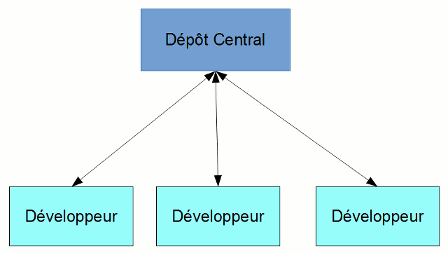
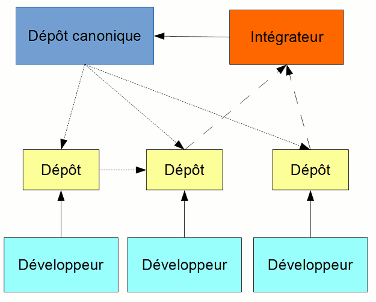

# Présentation d'un rapport technique sur le logiciel de gestion de versions décentralisé Git

### Par Justin Duplessis

#### Document basé sur la [documentation officielle Git](http://git-scm.com/doc), la [documentation Atlassin](https://www.atlassian.com/fr/git/tutorial/) et [l'encyclopédie libre Wikipédia](https://wikipedia.org) en Mars 2014

#### Publié sous la licence Creative Commons CC BY-NC-SA 4.0 
 
###### Version du document: 0.0.2

---

## Table des matières

1. [Qu'est qu'un logiciel de gestion de versions ?](#whatis)
    * [Accès au dépôt](#access)
        * [Centralisé](#centralise)
        * [Décentralisé](#decentralise)
        * [Local](#local)
    * [Git et ses objectifs](#git)
2. [Fonctionnement]/(#basic)
    * [Les instantanés VS différences]/(#snapshots)
    * [Contrôle de l'intégrité]/(#hash)
3. [Les trois états des fichiers]/(#stages)
    * Répertoire de travail / Working directory]/(#edited)
    * [Zone d'index / Staging]/(#staged)
    * [Validation / Commit]/(#commited)
4. [Utilisation de Git]/(#usage)
    * [Intialiser un environnement]/(#initclone)
        * [Cloner]/(#clone)
        * [Créer]/(#init)
    * [Travailler avec les instantanés]/(#commits)
        * [Ajouter des fichiers aux modifications]/(#stage)
        * [Enlever des modifications locales]/(#unstage)
        * [Enregistrer les modifications]/(#commit)
        * [Annuler les modifications publiques]/(#revert)
        * [Obtenir une ancienne version]/(#checkout-commit)
        * [Comparer les modifications]/(#diff)
        * [Ingorer des fichiers]/(#gitignore)
    * [Travailler avec les branches]/(#branches)
        * [Créer une nouvelle branche]/(#branch)
        * [Changer de branche]/(#checkout)
        * [Fusionner des branches]/(#merge)
5. [Branches distantes]/(#online)
    * [Pousser]/(#push)
    * [Synchroniser]/(#pull)
    * [Effacer une branche distante]/(#delete-branch)
6. [Gérer les problèmes dans le code]/(#debug)
    * [Annotations]/(#blame)
    * [Recherche dichotomique d'un bogue]/(#bisect)
        
---
    
##  1. Qu'est qu'un logiciel de gestion de versions ?

Un logiciel de gestion de versions est un logiciel qui gère et conserve un ensemble de fichier et de leurs différentes versions à travers le temps dans une arborescence que l'ont appel dépôt.
L'utilisation des logiciels de version est surtout utilisé pour gérer du code source, mais peut s'appliquer à d'autres utilisations.

### Types des dépôts 

Il existe trois types de logiciels de gestion de versions:

* Centralisé
* Décentralisé
* Local

La majeure différence des gestionnaire de versions se fait sur la manière donc les clients enregistrent leurs modifications dans le dépôt.

---

####  Centralisé
Un logiciel de gestion de versions centralisé enregistre le dépôt à un seul endroit et les client n'ont que le minimum sur leur poste.

Un gestionnaire de versions centralisé **requiert donc un serveur** qui a comme rôle de conserver l'arborescence et ses modifications et d'interragir avec les clients afin d'enregistrer de nouvelles modifications et distribuer l'arborescence.

Toutes les opérations relatives aux branches et aux consignations ne peuvent être enregistrées qu'avec une connexion au serveur.
Dans le cas d'une panne, les utilisateurs **ne peuvent pas** aller chercher d'anciennes modifications ni en enregistrer de nouvelles car ils n'ont que leur version courante des fichiers.

Subversion (SVN) de la fondation Apache et Team Foundation Server (TFS) de Microsoft sont de bons exemples de logiciels de gestion de versions centralisés encore beaucoup utilisés.

---

####  Décentralisé

Un gestionnaire de versions décentralisé ne requiert pas de serveur central car chaque client a l'entièreté des données relatives à l'arborescence ainsi que ses modifications.

Toutes les opérations relatives aux consignations et aux branches sont traités localement par le gestionnaire de versions installé. Ensuite, le client peut décider de publier sur un serveur ses modifications.

Il est à noter que le serveur et les clients vont avoir exactement les mêmes données.
Si le serveur tombe en panne ou est inaccessible, les utilisateurs peuvent tout de même enregistrer des modifications sur leur poste et les envoyer plus tard au serveur.

Lors de l'envoie de nouvelles modifications, le client doit d'abord être à la même version que le serveur.

Les gestionnaires de versions décentralisés permettent un développement hiérarchique, une technique qui est beaucoup plus difficile à atteindre avec un logiciel centralisé.

Voici un exemple de 3 programmeurs qui publient chacun sur leur dépôt et demandent à un intégrateur de pousser vers le dépôt canonique.

 Un dépôt canonique est un dépôt où seul des personnes de confiances ont accès en écriture et tous les autres développeurs prennent leur code à jour en lecture.

BitKeeper est un logiciel de gestion de versions décentralisé propriétaire qui a fortement inspiré le développement de Git et Mercurial.

---

####  Local

Similaire au gestionnaire décentralisé, mais ne supporte pas la publication à un serveur. 

N'est utile que dans les cas où le projet n'est modifié que sur un poste.

Les logiciels de gestion de versions locaux ne sont pas fait pour partager, mais permetent la plupart du temps de naviguer avec les branches et les consignations.

---

###  Git

Git est un logiciel libre écrit par Linus Torvalds et publié sous la license GNU GPL v2 en avril 2005.
Ce gestionnaire de versions a été conçu pour ne pas avoir besoin d'un serveur centralisé afin de gérer les modifications d'une arborescence et vise un support complet du développement non-linéaire.

En effet, c'est avec Git que le système d'opération Linux est développé et peut bénéficier d'un modèle de développement "dictateur bienveillant".
Ce modèle permet à plusieurs lieutenants ou responsables de recevoir des modifications sur des modules qui leurs sont attribués et d'envoyer au dictateur bienveillant pour l'intégration finale.

**ajouter le schéma**

L'utilisation de git peut aussi se faire sans connexion réseau ou serveur dans le cas où une personne veut garder la gestion de versions sur une machine locale.
Dans le cas d'une utilisation à plusieurs développeur, git permet la publication à un serveur.

Le protocole git peut être utilisé lors de la publication ou les protocoles standards SSH, HTTPS, HTTP, FTP et rsync.

---

[Retour à la page d'acceuil](index.html)

---

 Rapport technique sur Git de <a xmlns:cc="http://creativecommons.org/ns#" href="https://github.com/drfoliberg" property="cc:attributionName" rel="cc:attributionURL">Justin Duplessis</a> est mis à disposition selon les termes de la <a rel="license" href="http://creativecommons.org/licenses/by-nc-sa/4.0/deed.fr">licence Creative Commons Attribution - Pas d’Utilisation Commerciale - Partage dans les Mêmes Conditions 4.0 International</a>.

---