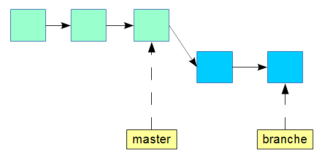
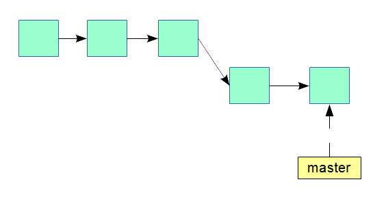
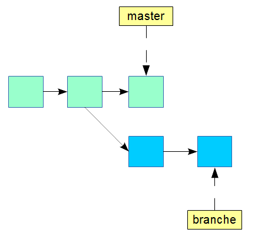
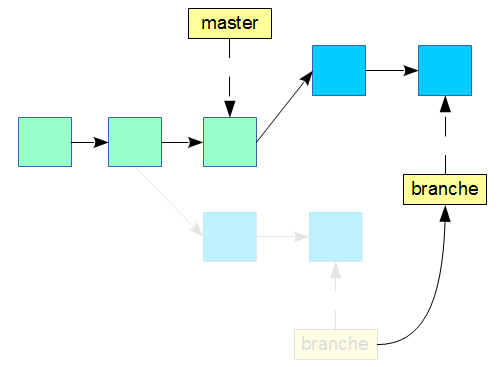
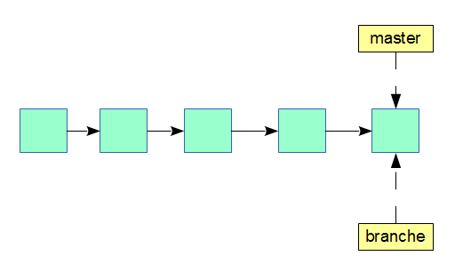

# Présentation d'un rapport technique sur le logiciel de gestion de versions décentralisé Git

### Par Justin Duplessis

#### Document basé sur la [documentation officielle Git](http://git-scm.com/doc), la [documentation Atlassian](https://www.atlassian.com/fr/git/tutorial/), [l'encyclopédie libre Wikipédia](https://wikipedia.org) et les [pages man](https://www.kernel.org/pub/software/scm/git/docs/)

#### Publié sous la licence Creative Commons CC BY-NC-SA 4.0
 
###### Version du document: 1.0.0
##### Présenté dans le cadre du rapport de stage hiver 2014 au collège Montmorency

---

### Objectifs du document

> * Présenter les différences entre les logiciels de versions centralisés et décentralisés
> * Présenter les différents processus de développement possibles
> * Présenter une utilisation poussée de logiciel Git

## Table des matières

1. [Qu'est qu'un logiciel de gestion de versions ?](#whatis)
    * [Centralisé](#centralise)
    * [Décentralisé](#decentralise)
    * [Local](#local)
2. [Fonctionnement de Git](#git)
    * [Les instantanés](#snapshots)
    * [Contrôle de l'intégrité](#hash)
    * [Communication entre les dépôts](#github)
    * [Développement hiérarchique](#dictator)
3. [Les trois états des fichiers](#stages)
    * [Répertoire de travail](#edited)
    * [Zone d'index](#stage)
    * [Méta-données](#commited)
4. [Utilisation de Git](#usage)
    * [Initialiser un environnement](#initclone)
        * [Cloner](#clone)
        * [Créer](#init)
    * [Travailler avec la zone d'index](#index)
        * [Ignorer des fichiers](#gitignore)
        * [Consulter la zone d'index](#status)
        * [Ajouter des modifications à l'index](#add)
        * [Enlever des modifications de l'index](#reset)
        * [Remisage des modifications](#stash)
    * [Travailler avec les instantanés](#commits)
        * [Enregistrer les modifications de l'index](#commit)
        * [Identifiants de consignations](#id)
        * [Consulter les instantanés](#log)
        * [Annuler des consignations](#revert)
        * [Obtenir une ancienne version](#checkout-commit)
        * [Comparer des consignations](#diff)
    * [Travailler avec les branches](#branches)
        * [Créer une nouvelle branche](#branch)
        * [Changer de branche](#checkout)
        * [Fusionner des branches](#merge)
        * [Rebaser des branches](#rebase)
        * [Supprimer une branche locale](#del-local)
5. [Branches distantes](#online)
    * [Ajouter un dépôt distant](#remotes)
    * [Pousser](#push)
    * [Synchroniser](#pull)
    * [Effacer une branche distante](#delete-branch)

---
    
## 1. Qu'est qu'un logiciel de gestion de versions ? {#whatis}

Un logiciel de gestion de versions est un logiciel qui gère et conserve un ensemble de fichier et de leurs différentes versions à travers le temps dans une arborescence que l'ont appel dépôt.
L'utilisation des logiciels de version est surtout utilisé pour gérer du code source, mais peut s'appliquer à d'autres utilisations.

Le but visé est de conserver et de partager dans une équipe un historique des modifications et des informations relatives aux changements apportés (qui, quand, où, pourquoi).
La plupart des gestionnaires de versions fournissent des outils afin de comparer les fichiers à leurs différents niveaux de développement et permettent de restaurer les anciennes versions du projet en intégralité.

Il existe principalement 3 types de gestionnaires de versions:

* Centralisé
* Décentralisé
* Local

La majeure différence des gestionnaire de versions se fait sur la manière donc les clients enregistrent leurs modifications dans le dépôt et peut fortement affecter le processus de développement si le 
gestionnaire de versions n'est pas adapté.

Ce document a pour buts de démontrer l'utilisation du gestionnaire de versions Git et comparer en quoi certaines alternatives peuvent handicaper le processus de développement.

---

### Centralisé {#centralise}
Un logiciel de gestion de versions centralisé enregistre le dépôt à un seul endroit et les client n'ont que le minimum sur leur poste.

Un gestionnaire de versions centralisé **requiert donc un serveur** qui a comme rôle de conserver l'arborescence et ses modifications et d'interagir avec les clients afin d'enregistrer 
de nouvelles modifications et distribuer l'arborescence.

Toutes les opérations relatives aux branches et aux consignations ne peuvent être enregistrées qu'avec une connexion au serveur.
Dans le cas d'une panne, les utilisateurs **ne peuvent pas** aller chercher d'anciennes modifications ni en enregistrer de nouvelles car ils n'ont que leur version courante des fichiers.

{.center-block}

**Exemple de logiciels**

Subversion (SVN) de la fondation Apache et Team Foundation Server (TFS) de Microsoft sont de bons exemples de logiciels de gestion de versions centralisés encore beaucoup utilisés.

---

### Décentralisé {#decentralise}

Un gestionnaire de versions décentralisé **ne requiert pas** de serveur central car chaque client a l'entièreté des données relatives à l'arborescence ainsi que ses modifications.

Toutes les opérations relatives aux consignations et aux branches sont traités localement par le gestionnaire de versions installé. Ensuite, le développeur peut décider de publier sur un 
[dépôt canonique](#canonique) ses modifications.

Il est à noter que le dépôt canonique et les dépôts clients vont avoir exactement les mêmes données une fois synchronisés.
Si le dépôt canonique est inaccessible, les utilisateurs peuvent tout de même enregistrer des modifications sur leur poste et les envoyer plus tard au dépôt.

Les gestionnaires de versions décentralisés permettent un **développement hiérarchique**, une technique qui est beaucoup plus difficile à atteindre avec un logiciel centralisé.

Voici un exemple de 3 développeurs qui [poussent](#push) chacun sur un dépôt public des modifications de codes.

Le développeur du milieu décide d'intégrer les changements du développeur de gauche dans son dépôt public avec une [synchronisation](#pull) et demandent à un intégrateur de synchroniser le 
[dépôt canonique](#canonique) avec les modifications de son dépôt public.
Le développeur de droite pousse lui aussi ses modifications sur son dépôt public et demande à l'intégrateur d'inclure ses changements comme l'autre développeur.

L'intégrateur a alors le choix d'accepter les [demandes de synchronisation](#pull-request).
Une fois les changements intégrés au dépôt canonique, les développeurs peuvent synchroniser leur dépôt, mais ne sont pas obligés pour continuer leur développement immédiat.

{.center-block}

**Exemple de logiciels**

BitKeeper est un logiciel de gestion de versions décentralisé propriétaire qui a fortement inspiré le développement de Git et Mercurial.

---

### Local {#local}

Similaire au gestionnaire décentralisé, mais ne supporte pas la publication à un serveur. 

N'est utile que dans les cas où le projet n'est modifié que sur un poste.

Les logiciels de gestion de versions locaux ne sont pas fait pour partager, mais permettent la plupart du temps de naviguer avec les branches et les consignations.

Le développement et l'utilisation de ces logiciels de versions ne sont plus vraiment actif.

---

## 2. Fonctionnement de Git {#git}

Git est un logiciel libre écrit par Linus Torvalds et publié sous la licence GNU GPL v2 en avril 2005.
Ce gestionnaire de versions a été conçu pour ne pas avoir besoin d'un serveur centralisé afin de gérer les modifications d'une arborescence et vise un support complet du développement non-linéaire.

Ces spécifications sont dues au fait que Git a été conçu pour remplacer l'ancien gestionnaire de contrôle pour le système d'exploitation Linux. Ce système d'exploitation est développé par plus de 
8000 contributeurs autour du monde et nécessite un processus de [développement bien particulier](#dictator).

C'est un logiciel de versions de contrôles qui plait maintenant aux petits comme aux grands projets grâce à sa flexibilité, sa rapidité et sa robustesse.

---

### Les instantanés {#snapshots}

Lorsqu'un utilisateur [consigne](#commit) son code, Git enregistre un instantané du répertoire. C'est à dire qu'une copie de chaque fichier est effectuée.
Bien entendu, les fichiers n'ayant pas changés sont enregistrés sous la forme d'un pointeur au même fichier de la consignation précédente.

Git conserve les instantanés  et leur position dans le temps afin de reconstituer l'historique des changements.
Git est donc dépendant de l'historique des modifications, mais pas autant que certains gestionnaires de versions qui utilisent la différence entre chaque fichier à chaque consignation afin 
d'essayer d'optimiser l'espace disque requis.

Git gagne en rapidité parce que la décompression de dizaines, voire de centaines de consignations n'est pas nécessaire lors de la comparaison de deux consignations et toutes les opérations de 
comparaisons s'effectuent localement.

---

### Contrôle de l'intégrité {#hash}

La robustesse de Git vise le protection contre les erreurs utilisateurs et les erreurs matérielles.

**Erreurs utilisateurs**

Les changements dans l'historique ne vont pas effacer des parties de codes ou réécrire par dessus une ancienne modification.
Git peut "revenir en arrière" en créant un pointeur vers une ancienne consignation.

Git va empêcher l'utilisateur de changer de branche ou de consignation courante si des changements sont dans son [espace de travail](#edited), mais pas dans la [zone indexée](#staged).
Étant donné que les autres versions ne sont pas accessibles, il est impossible pour l'utilisateur de se tromper de branche et d'oublier des modifications.

**Erreurs matérielles**

Les consignations sont enregistrées sous forme d'objets et pointent vers d'autres objets tels que des objets de hiérarchie ou de stockage.
À l'enregistrement des objets, une somme [SHA1](http://fr.wikipedia.org/wiki/SHA-1) est calculé et est le nom du fichier de l'objet.

Étant donné de la nature de l'algorithme SHA1, il est très rapide et facile pour Git de vérifier l'intégrité de chaque objet.
Si un octet change dans l'historique ou dans un fichier (n'importe quel objet en fait), Git va aviser d'une corruption.

En même temps, ces clés SHA1 servent de pointeurs pour d'autres objets.

---

### Communication entre les dépôts {#github}

Dans la plupart des cas, une équipe de développement n'aura pas besoin d'un serveur Git car de nombreux services existants remplissent la tâche.
Prenons l'exemple simple de Alice et Bob voulant travailler sur un projet ensemble sur le site [GitHub](https://github.com) qui hébergera 
le [dépôt canonique](#canonique).

Il va avoir trois dépôts au total; un sur le poste de chaque développeurs et un sur le serveur de GitHub.

{.center-block}

Alice et Bob auront les deux accès en écriture au répertoire canonique car ils se font confiance. Leur processus de développement ressemble à ce qu'une équipe avec un gestionnaire de versions centralisé ferait.

Alice fait des modifications et la consigne, cette dernière n'est disponible que sur son poste. Alice doit pousser vers le répertoire canonique sa consignation.

Bob peut continuer à développer et finir ses objectifs de modifications comme si rien ne s'était passé. En fait, l'autre développeur n'est peut-être même pas au courant de ce qui s'est produit.

Après un certain nombre de consignations, Bob décide de pousser vers le dépôt canonique. Or, sa branche de dépôt local doit être [synchronisée](#pull) avec la branche du dépôt canonique.
C'est une étape assez simple et Git va s'occuper de [fusionner](#merge) les modifications faites sur la branche distante vers la branche courante en créant une nouvelle consignation localement.
Il suffit ensuite de [pousser](#push) au dépôt canonique les dernières modifications rendant ainsi public le fusionnement des dépôts.

---

### Développement hiérarchique {#dictator}

Reprenons l'exemple précédant. Avec la montée du projet de Alice et Bob, Ève souhaite se joindre à l'équipe, mais ni Bob ni Alice ne connait Ève.

Sans même avoir besoin de l'autorisation du dépôt canonique, Ève peut copier le dépôt et travailler localement. Lorsqu'Ève veut pousser vers le dépôt canonique, elle devra pousser sur un dépôt 
public qui lui appartient afin se faire une demande de synchronisation au dépôt canonique.
Le site GitHub fournit cette fonctionnalité et c'est à la base du processus de développement logiciel libre.

Alice et Bob acceptent la demande et c'est le dépôt canonique qui se [synchronisera](#pull) avec le dépôt public de Ève.

{.center-block}

En effet, c'est avec Git que le système d'opération Linux est développé et peut bénéficier d'un modèle de développement **dictateur bienveillant**.
Ce modèle permet à plusieurs lieutenants ou responsables de recevoir des modifications sur des modules qui leurs sont attribués et d'envoyer au dictateur bienveillant pour l'intégration finale.

{.center-block}

---

## 3. Les trois états d'un fichier {#stages}

Afin de commencer à utiliser Git et d'enregistrer des modifications, il faut s'assurer de bien comprendre les 3 états des fichiers que considère le logiciel Git.

Les états des fichiers suivent bien évidemment le cours des modifications et des consignations faites par l'utilisateur.

Nous aborderons les états suivants:

* Répertoire de travail
* Zone d'index
* Méta-données

---
Le schéma qui suit illustre le processus que suivent les modifications de l'utilisateur.

{.center-block}

---

### Répertoire de travail {#edited}

La zone de travail est l'arborescence des fichiers du projet qui sont directement accessibles sur le disque par l'utilisateur.

Les modifications faites dans la zone de travail ne seront pas inclus lors une [consignation](#commit). Afin d'enregistrer des modifications faites dans le répertoire de travail, 
l'utilisateur doit [ajouter à la zone d'index](#add) ses changements.

Lorsque le dépôt local va être [synchronisé](#pull) ou va changer de branche, Git vérifie si des modifications sont présentes dans le répertoire de travail et empêcher l'utilisateur 
de continuer si tel est le cas.

**N.B.** En anglais, le répertoire de travail a comme nom _working directory_.

---

### Zone d'index {#stage}

L'index contient ce qui sera consigné lors de la prochaine consignation.
L'index une zone dynamique, car l'utilisateur peut facilement modifier cette zone sans devoir faire des changements à un historique.

Il faut [ajouter](#add) à l'index les fichiers de la zone de travaille dont nous voulons inclure les modifications.

En tout temps, il est facile de [consulter l'index](#status) afin de vérifier quels fichiers sont dans l'index.

Il est également possible d'[enlever des fichiers de l'index](#reset). 

**N.B.** En anglais, l'index a **aussi** comme nom _staging_.

---

### Méta-données {#commited}

Les métas-données sont en fait une structure d'objets compressés du dépôt local contenant l'historique des consignations et ne sont pas directement accessibles par l'utilisateur.

L'historique des consignations peut toutefois être consulté avec une [commande](#log) qui analyse les métas-données.

Tout changement à cette zone passe par les branches ou les instantanés et affecte l'historique.

L'utilisateur peut avec une consignation, [ajouter l'index](#commit) aux métas-données.

**N.B** L'ajout d'un instantané aux métas-données ne fait qu'ajouter **localement** les modifications. 

Il faut [pousser](#push) les métas-données du dépôt courant à un autre afin de rendre public la création de consignations ou de branches.

---

## 4. Utilisation de Git {#usage}

L'utilisation du logiciel Git se fait surtout par ligne de commande, mais des [interfaces graphiques](#gitk) sont aussi disponibles.

Ce chapitre portera sur les différentes commandes de base de Git qui permettent de travailler avec un dépôt local.

Ces commandes reflètent les actions de bases de Git. Le nom des commandes est littéralement le nom de l'action et même dans une interface graphique, les mêmes termes s'y retrouveront.

---

### Initialiser un environnement {#initclone}

Il existe deux moyens internes à git afin d'avoir un dépôt Git sur sa machine locale.

Pour un projet déjà existant, l'utilisateur devra [cloner un dépôt public](#clone).

Pour la création d'un dépôt qui sera partagé, il est recommandé de créer un dépôt sur le site qui hébergera le dépôt public (ou privé) et ensuite cloner.

Dans le cadre d'un nouveau projet local, l'utilisateur peut lui-même [initialiser](#init) un dépôt. 

Lorsqu'un utilisateur crée un dépôt en ligne à l'aide d'un service offert par un site Internet, un serveur Git initialise un dépôt ce qui permet à l'utilisateur de le cloner.

---

#### Cloner un dépôt distant {#clone}

Si un dépôt est disponible en ligne, il est facile de cloner le dépôt avec différent protocoles.

~~~
git clone https://github.com/drfoliberg/doc-git
~~~

Le dépôt sera créé dans le répertoire courant dans le nouveau dossier doc-git.

Le dossier doc-git sera alors reconnut comme un dépôt valide et Git configurera **automatiquement** le dépôt distant cloné comme étant le dépôt distant.

C'est à dire que les changements seront poussés vers le dépôt distant cloné.

---

#### Créer un nouveau dépôt {#init}

Si du code déjà existant est dans un répertoire, il est possible d'initialiser un dépôt dans ce répertoire.
En étant dans le répertoire racine de code la commande init va créer le dossier d'index et de méta-données .git

~~~
cd /home/justin/projets/moncode
git init
~~~

Le répertoire est maintenant reconnut par Git comme étant un dépôt local valide et l'utilisateur peut commencer à consigner son code.

Toutefois, il faudra [ajouter un dépôt distant](#remotes) pour pouvoir y pousser des consignations ou synchroniser son dépôt.

---

### Travailler avec la zone d'index {#index}

La manipulation de la zone d'index ou [staging](#staging) est importante afin d'avoir un contrôle total sur ce qui devra être consigné, 
mais peut être outrepassée lorsque tout doit être mis en consignation.

Il est tout de même fortement recommandé de pouvoir ajouter des changements à la zone d'index ainsi que de gérer quels fichiers s'y retrouveront.

---

#### Ignorer des fichiers {#gitignore}

Dans la plupart des projets, les développeur vont avoir des fichiers qu'ils ne voudront jamais ajouter à la zone d'index. 

Pour ce faire, les fichiers `.gitignore` contiennent une liste d'expressions de fichiers à exclure récursivement.

Les opérateurs de base `!` et `*` utilisés dans les [d'expressions rationnelles](http://www.regular-expressions.info/) sont supportées. 

Afin d'ajouter des fichiers ou des dossiers à ignorer, il faut manuellement modifier le fichier gitignore du répertoire.

Par exemple, dans projet de développement Python, il peut être intéressant de ne pas vouloir les fichiers compilés .pyc.

Pour ignorer les fichiers tous les fichiers .pyc nous allons donc ajouter l'expression \*.pyc au nouveau fichier .gitignore à la racine du projet.

~~~
echo "*.pyc" >> ~/gitRepos/Doc-Git/.gitignore
~~~

Pour exclure les fichiers .tmp dans le dossier config seulement, il faut faire un fichier .gitignore dans le dossier config

~~~
echo "*.tmp" >> ~/gitRepos/Doc-Git/config/.gitignore
~~~

---

#### Consulter la zone d'index {#status}

La zone d'index n'est pas enregistrée comme tel sous forme de fichiers lisibles directement par l'utilisateur.
Il est tout de même facile de consulter les modifications qui sont dans la zone d'index avec la commande `status`.

~~~
$ git status
# On branch master
# Changes to be committed:
#       modified:   .gitignore
#       modified:   rapport.md
~~~

Dans ce premier cas, j'ai pris soin de tout ajouter l'index, mais la commande status peut aussi montrer les modifications en attente encore dans la [zone de travail](#edited).

L'exemple qui suit est le même dépôt, mais avec de nouvelles modifications qui n'ont pas encore été ajoutées à l'index:

~~~
$ git status
# On branch master
# Changes to be committed:
#       modified:   .gitignore
#       modified:   rapport.md
#
# Changes not staged for commit:
#       modified:   rapport.md
~~~

Pour comparer deux versions de fichiers, l'outil [diff](#diff) permet de comparer ligne par ligne des fichiers de la zone de travail, d'une branche ou d'une consignation précise.

Voir la section sur [diff](#diff) pour plus d'informations.

---

#### Ajouter des modifications à l'index {#add}

Pour ajouter manuellement un fichier il faut utiliser la commande `add`.

~~~
git add nouveaufichier.txt
~~~

Pour ajouter tous les fichiers du répertoire courant, on peut dénoter avec `.`

~~~
git add .
~~~

Il est à noter que les fichiers du [gitignore](#ignore) ne seront pas ajoutés même si nous spécifions directement le fichier.
Voici un exemple que Git va afficher. Les messages changent parfois de versions en versions.

~~~
$ echo "*.tmp" >> .gitignore
$ git add allo.tmp
The following paths are ignored by one of your .gitignore files:
allo.tmp
Use -f if you really want to add them.
fatal: no files added
~~~

Git averti l'utilisateur qu'aucun fichier n'a été ajouté à cause des règles du [gitignore](#ignore), mais qu'il est possible de forcer l'ajout 
avec le modificateur `-f`.

~~~
git add -f allo.tmp
~~~

---

#### Enlever des modifications de l'index {#reset}

La commande `reset` est la seule commande de Git qui enlève des changements **sans laisser des traces dans le dépôt**. 

Il est donc fortement recommandé de _lire attentivement_ sur cette commande avant de commencer à l'utiliser.

La commande reset peut s'utiliser en donnant un nom de fichier ou non.

Si aucun nom de fichier n'est donné, **tout le dossier courant sera affecté !**

~~~
git reset [nom du fichier]
~~~

Dans la situation suivante, un utilisateur modifie les fichiers _sectionB/fichierB.txt_ et _sectionB/fichierB.txt_, les ajoute dans la zone d'index et décide finalement 
de retirer les modifications de la sectionB.

~~~
# Modifications des fichiers
$ git add .
$ git status
# On branch master
# Changes to be committed:
#       new file:   sectionA/fichierA.txt
#       new file:   sectionB/fichierB.txt
$ git reset sectionB
# On branch master
# Changes to be committed:
#       new file:   sectionA/fichierA.txt
#
# Untracked files:
#       sectionB/
~~~

Le répertoire de travail n'a pas changé dans ce cas. Seulement ce qui sera inclut dans une consignation à ce moment.

Si un utilisateur travaille sur son dépôt et fait de graves erreurs, le modificateur `--hard` peut être combinée à la commande reset afin d'enlever les modifications faites au répertoire 
de travail ainsi que l'index.

Encore une fois, **aucun historique** n'est conservé et il est important de bien penser à ce qu'il faut faire.

**N.B.** le modificateur --hard ne peut être utilisée pour un dossier

~~~
$ git status
# On branch master
# Changes to be committed:
#       new file:   sectionA/fichierA.txt
#       new file:   sectionB/fichierB.txt
$ git reset --hard
HEAD is now at 9559362 ok
~~~

Dans l'exemple précédent, toutes les modifications ont été annulées et le dépôt est revenu à l'état de la consignation précédente.

---

#### Remisage des modifications {#stash}

Lors du développement, il est possible que le processus soit interrompu avec des bogues urgent à régler.

Dans cette situation, la commande `stash` permet de placer le répertoire de travail et l'index courants dans une **remise** ou _stash_ et de les réinitialiser au bon moment.

Pour le développeur, cela peut signifier que son travail en cours doit être interrompu et doit travailler sur un répertoire et un index _propres_. 

Par exemple, dans le fichier sectionA/fichierA.txt, une erreur de syntaxe a été découverte dans la consignation précédente.

Le développeur doit au plus vite modifier et consigner ce changement, mais il est déjà en train de modifier ce fichier.

En remisant son répertoire de travail, cela lui permet d'obtenir une espace de travail d'une consignation précédente.

Le développeur peut alors réparer le code et consigner cette modification, puis remettre son ancien répertoire de travail afin de pouvoir continuer à écrire comme avant.

Voici le processus que le développeur suivra dans la situation précédente

* Consigne ses modifications (bogue introduit ici)
* Travaille sur une nouvelle fonctionnalité
* Interruption par le bogue introduit dans la première étape
* Remisage de ses nouvelles modifications
* Correction du bogue sur un répertoire de travail propre
* Consignation de la réparation
* Restauration de la remise
* Continue à développer sa nouvelle fonctionnalité

**Remiser son espace de travail**

~~~
git stash 
~~~

L'index et le répertoire de travail courants seront remisés et seront réinitialisés dans le dépôt courant à l'état de la dernière consignation.

~~~
git stash save
~~~

L'index et le répertoire de travail courants seront remisés, mais resterons inchangés.

**Restaurer son espace de travail**

~~~
git stash apply [id de remise]
~~~

L'identifiant de remise peut être omis et sera remplacé par la dernière remise, sinon consulter la liste des remises en mémoire afin de trouver le bon identifiant.

~~~
git stash pop [id de remise]
~~~

Cette dernière commande a le même comportement que `apply`, mais supprimera la remise de la liste des remises.

**Consulter les remises en mémoire**

~~~
git stash list
~~~
Produit la liste des remises.

~~~
git stash show [id de remise]
~~~
Cette commande montrera les statistiques (les fichiers et les nombres de lignes modifiées) relatives à une remise.

**Supprimer une remise**
Pour supprimer une remise qui n'est plus nécessaire.

~~~
git stash drop [id de remise]
~~~

---

### Travailler avec les instantanés {#commits}

Les instantanés ou consignations ont comme nom commun en anglais `commit`. Les consignations sont en quelques sorte les modifications persistantes du dépôt à rendre publiques.

Lorsqu'une nouvelle fonctionnalités a été implémentée ou un bogue a été réglé, il est convenu de faire une consignation.

La création d'une consignation est presque instantanée et ne requiert pas d'accès réseau à quelconque serveur. C'est une opération locale qui pourrait ensuite être [poussée](#push) 
vers un [dépôt public](#remotes).

Lors du développement, il est important de consigner et de pousser son code de temps en temps afin de ne pas perdre du travail si un bris ou une erreur arrive.

La consignation de code permet aussi de [revenir à des instantanés](#checkout-commit) précédents et de [comparer](#diff) les différences entre plusieurs instantanés.

Les consignations permettront des structurer des [branches](#branches).

---

#### Enregistrer les modifications de l'index {#commit}

À tout moment, il est possible d'enregistrer le contenu de l'[index](#index) vers les [méta-données](#commited). Les consignations vont garder l'heure de l'enregistrement, l'utilisateur 
courant et un message de l'utilisateur.

Un message descriptif est nécessaire lors de la consignation et c'est une bonne pratique de prendre un peu de temps afin d'écrire un message décrivant ce qui a été changé et de mettre le 
numéro du _issue_ affecté. **reformuler**

Afin de consigner, la commande `commit` est utilisée. Il est courant d'inclure un message avec le modificateur `-m` ou `--message`.

~~~
git commit -m "mon message de commit"
~~~

Il est possible d'écrire plusieurs lignes dans un message de consignation en combinant plusieurs fois l'argument `-m`.

~~~
git commit -m "Bogue 7424" -m "La variable x utilisait le mauvais scope"
~~~

Lors de consignations, l'ajout des fichiers à la zone d'index manuellement peut-être évité avec le modificateur `-a` ou `--all`.
Le modificateur `--all` ajoutera automatiquement toutes le modifications qui sont dans le répertoire de travail à l'index avant de continuer la consignation.

~~~
git commit -am "mon message de commit"
~~~

---

#### Identifiants de consignations {#id}

Lorsqu'une consignation est faite, un identifiant SHA-1 est créé.

Cet identifiant est d'une longueur de 40 caractères hexadécimal et il peut être difficile de se rappeler ou de taper en long les identifiants.

Pour cette raison, il existe deux raccourcis afin de faire référence à une consignation.

##### **Absolu abrégé** {#absoluteid}

Il est possible d'abrégé les identifiants en m'écrivant que les premiers caractères. Dans la plupart des cas, Git va n'afficher que les 7 premiers caractères des identifiants.

La plupart du temps, l'utilisateur peut entrer les 4 premiers caractères d'une consignation et Git va reconnaître l'identifiant.

Par exemple, l'identifiant `a1685c1f2f2dde9b161ad2a35afcea650ed888c7` pourra être abrégé à `a168`.

Si un identifiant similaire possède les même premiers caractères, Git va retourner une erreur et avertir que l'identifiant est ambigüe.

Par exemple, les identifiants `a1685c1f2f2dde9b161ad2a35afcea650ed888c7` et `a16852e4fc161ad2aea688c7f2f2dde9b35` sont introduits dans le projet.

Étant donné que les 4 premiers caractères sont équivalents, l'utilisateur devra rentrer au moins les 5 premiers caractères.
 
##### **Relatif** {#relativeid}

Il est possible de référer à une consignation par sa position relative à une autre consignation ou à une branche.

Par exemple, la référence `HEAD^1` va faire référence à l'avant dernière consignation de la branche HEAD. 

---

#### Consulter les instantanés {#log}

Pour voir un résumé des consignations précédentes, la commande `log` est utilisée.

Lors que beaucoup de consignations sont disponibles, il peut être intéressant de limiter le nombre de consignations.

~~~
$ git log -2
commit a1685c1f2f2dde9b161ad2a35afcea650ed888c7
Author: Justin Duplessis <drfoliberg@gmail.com>
Date:   Wed Apr 9 17:02:14 2014 -0400

    message 1

commit aac79b084b09aca090ce783672e975bdae5aa612
Author: Justin Duplessis <drfoliberg@gmail.com>
Date:   Tue Apr 8 17:42:21 2014 -0400

    message 2
~~~

Dans l'exemple précédent, le modificateur `-2` limite le nombre de consignations à afficher à 2. Ce pourrait être n'importe quel entier positif.

Différents formats d'affichage sont disponibles tels que `--stat` et `-p`.

Git offre une multitude de formats prédéfinis et offre même la possibilité d'écrire ses propres formats d'affichages.
Plus d'informations sont disponibles sur le [site officiel](http://git-scm.com/book/en/Git-Basics-Viewing-the-Commit-History).

Le modificateur `--stat` montre sommairement le nombre de lignes modifiées pour chaque fichier.

Le modificateur `-p` montre la différence complète ligne par ligne pour les consignations et est similaire à l'outil [diff](#diff).

Voici un exemple du format `--stat`.

~~~
$ git log -1 --stat
commit aac79b084b09aca090ce783672e975bdae5aa612
Author: Justin Duplessis <drfoliberg@gmail.com>
Date:   Tue Apr 8 17:42:21 2014 -0400

    chapitre sur utilisation

 rapport.md | 52 ++++++++++++++++++++++++++++++++++++++++++++++++----
 1 file changed, 48 insertions(+), 4 deletions(-)
~~~

---

#### Annuler des consignations {#revert}

Afin d'annuler les effets d'une consignation, Git permet d'enlever des consignations sans toutefois détruire l'historique avec la commande `revert`.

**N.B.** Si une mauvaise consignation a été crée et n'a pas encore été poussé vers un autre dépôt, il est possible avec la commande [reset](#reset) de supprimer la consignation et son 
historique en spécifiant un numéro de consignation absolue ou relatif.

Les exemples suivants nécessiterons le concept de la [notation abrégée et relative](#id) des consignations.

Prenons exemple d'un dépôt avec les 2 dernières consignations suivantes.

~~~
$ git log -2
commit a2179089fce877f3444887244e61125a9172614d
Author: drfoliberg <drfoliberg@gmail.com>
Date:   Sat Apr 12 14:43:05 2014 -0400

    début de la section sur les commits

commit a1685c1f2f2dde9b161ad2a35afcea650ed888c7
Author: Justin Duplessis <drfoliberg@gmail.com>
Date:   Wed Apr 9 17:02:14 2014 -0400

    fin section index
~~~

Pour revenir à la consignation `a1685c1` ou `HEAD~`

~~~
git revert HEAD~
~~~

Le dépôt contiendra alors la nouvelle consignation `0082e2` qui soustrait les modifications la précédente.

~~~
$ git log -2
commit 0082e254c83de8f5f415dc8285f3aa651b479f61
Author: Justin Duplessis <drfoliberg@gmail.com>
Date:   Wed Apr 20 16:20:00 2014 -0400

    Revert "début de la section sur les commits"
    
    This reverts commit a2179089fce877f3444887244e61125a9172614d.
    
commit a2179089fce877f3444887244e61125a9172614d
Author: drfoliberg <drfoliberg@gmail.com>
Date:   Sat Apr 12 14:43:05 2014 -0400

    début de la section sur les commits
~~~

 {.center-block}

L'espace de travail des consignations `a217908` et `0082e2` sont les mêmes.

La consignation générée aura un message générique qui explique qu'est-ce qui a été enlevé.

Le modificateur `-e` ou `--edit` permet de modifier le message de consignation en ouvrant l'éditeur de texte par défaut du système. 

Afin de ne pas créer de nouvelle consignation automatiquement avec la commande `revert`, le modificateur `-n` ou `--no-commit` peut être ajoutée. Les changements ne seront alors 
appliquées qu'à l'index et le répertoire de travail.

~~~
git revert HEAD~ -n
~~~

---

#### Obtenir une ancienne version {#checkout-commit}

Git permet d'obtenir n'importe quelle version du projet comme répertoire de travail avec la commande `checkout`.

Si une version du projet à la consignation e4f324 plait particulièrement à un utilisateur, il peut rétablir cette version sans avoir à utiliser les commit `revert` ou `reset`.

**N.B.** Cette technique sert à obtenir une version précise des fichiers afin de compiler ou examiner le projet. C'est une mauvaise idée de rétablir une vielle version et de continuer 
le développement à ce stade sans [travailler avec des branches](#branches).

Cette commande a plusieurs usages. Afin de comprendre pourquoi, la compréhension des [branches](#branches) est nécessaire.

Afin de rétablir le répertoire de travail et l'index à une consignation spécifique, la commande `checkout` peut être appelée avec un numéro de consignation de cette façon.

~~~
git checkout HEAD~1
~~~

Afin de seulement obtenir un fichier, le nom du fichier peut être aussi ajouté de cette façon

~~~
git checkout HEAD~1 rapport.md
~~~

La commande `checkout` sera approfondit dans la section de [changement de branches](#checkout).

---

#### Comparer des consignations {#diff}

La commande `diff` permet de comparer à peu près tous les états et modifications du dépôt.

Par exemple, `diff` permet de comparer l'index au répertoire de travail dans sa plus simple forme.

~~~
$ git diff
index 1c9b77d..bc74b07 100644
--- a/fichier.txt
+++ b/fichier.txt
@@ -1 +1 @@
-ligne supprimée
+ligne ajoutée
~~~

Il est possible de comparer le répertoire de travail à n'importe quelle consignation en spécifiant son identifiant.
~~~
git diff HEAD
~~~

Le modificateur `--staged` ou `--cached` permet de comparer ce qui est dans l'index à une consignation.
~~~
git diff --staged HEAD
~~~

Afin de comparer deux consignation indépendamment de l'état courant du dépôt, deux identifiants peuvent être données séparés par `..`.
~~~
git diff HEAD~4..HEAD
~~~

Dans tous les cas, afin de seulement comparer un fichier, le nom peut être ajouté à la fin de la commande.
~~~
git diff fichier.txt
~~~

Comme avec la commande `log`, les options `--stat`, `summary` et [bien d'autres](http://git-scm.com/docs/git-diff) peuvent être ajoutés 
afin de changer le format des comparaisons.

Le modificateur `--color` peut être ajoutée afin de voir les lignes ajoutées en vert et les lignes enlevées en rouge.
~~~
git diff --color --staged HEAD fichier.txt
~~~

L'outil `diff` permet aussi de comparer directement des objets dans les méta-données.

Des dizaines d'opérateurs et options sont disponibles dans la [documentation officielle de Git](http://git-scm.com/docs/git-diff).

---

### Travailler avec les branches {#branches}

**Introduction aux branches**

Les branches sont en quelque sorte une ligne de développement. Les branches permettent de séparer le processus de développement à des consignations précises.

Une branche est une suite de consignation et jusqu'à maintenant, tous les exemples utilisaient implicitement la branche `master` qui est considérée comme la branche maitresse du projet.

Chaque développeur peut créer sa propre branche localement et ensuite la [pousser vers un dépôt public](#push).

Les branches permettent de pouvoir partager son code sans affecter le processus de développement d'un autre programmeur qui travaille sur une version spécifique du projet.

**Le développement par branches**

Nous n'aborderons pas en détails les différents processus de développement avec les branches, mais nous verrons rapidement le développement par fonctionnalité. 

Le développement par fonctionnalité consiste à créer une nouvelle pour chaque fonctionnalité.

En temps normal dans un processus par branches de fonctionnalités, la branche `master` n'est modifiée que lorsqu'une nouvelle version du programme est officiellement déployée en 
fusionnant des branches de fonctionnalités.

Évidemment, il est courant d'avoir une branche de développement sur laquelle les branches de fonctionnalités sont fusionnées pour tester avant de fusionner vers `master`.

Lorsqu'une nouvelle fonctionnalité est demandée, le développeur responsable devra [créer une branche](#branch) locale et la [pousser](#push) sur le dépôt officiel ou faire une 
[demande de synchronisation](#pull-request).

Pour plus d'explications sur les différentes méthodes de développement par branches, je vous invite à consulter la 
[documentation de Atlassian sur les processus de développement avec Git](https://www.atlassian.com/git/workflows) qui est complète tout en restant assez simple.

---

#### Créer une nouvelle branche {#branch}

La commande `branch` permet de visualiser une liste des branches du dépôt courant. La branche courante du dépôt est identifiée par le caractère `*` en début de ligne.

~~~
$ git branch
  autreBranche
* master
~~~

La commande `branch` peut aussi créer une nouvelle branche en spécifiant un nouveau nom.

Voici comment créer une nouvelle branche appelée `maBranche`
~~~
git branch maBranche
~~~

Il est à noter que la branche courante du dépôt **n'a pas changée**
~~~
$ git branch
  autreBranche
  maBranche
* master
~~~

La section [suivante](#checkout) expliquera comment changer de branche.

**Renommer une branche**
Il n'est pas recommandé de renommer une branche après l'avoir publiée, mais il est possible de renommer la branche courante avec la commande `branch` combinée avec le modificateur `-m`
~~~
$ git branch
  autreBranche
* maBranche
  master
  
$ git branch -m nouveauNom

$ git branch
  autreBranche
* nouveauNom
  master
~~~

---

#### Changer de branche {#checkout}

Précédemment, la commande `checkout` a permit de [changer de consignation](#checkout-commit), mais cette commande sert principalement à changer de branche courante.

Dans sa forme la plus simple, `checkout` est combiné avec le nom de la branche existante ciblée.
~~~
git checkout autreBranche
~~~

Pour les impatients, la commande `checkout` permet aussi de créer une nouvelle branche et de s'y déplacer avec le modificateur `-b`.
~~~
$ git branch
* master

$ git branch -m nouvelleBranche

$ git branch
* nouvelleBranche
  master
~~~

---

#### Fusionner des branches {#merge}

Afin de combiner le travail de plusieurs développeurs de manière élégante, il est important de bien fusionner les branches.

Fusionner des branches consiste à amener les modifications faites dans les branches sources vers une branche commune.

Le fusionnement de branches utilise la commande Git `merge`.

Il est possible la grande majorité du temps d'éviter les [conflits de fusionnement](#conflicts), mais il est parfois possible que Git ne puisse résoudre les conflits.
Des outils sont disponibles afin de résoudre les conflits et seront abordés rapidement dans la [section sur les conflits](#conflicts).

Dans sa forme la plus simple, un `merge` peut fusionner une branche spécifiée à la branche courante.
~~~
git merge maBrancheSource
~~~
Ce dernier exemple aura pour effet d'ajouter les consignations de la branche source vers la branche courante. Git va décider dans ce cas si une fusion [Fast-Forward](#fast-forward) ou 
[3-way](#3-way) est appropriée.
Il est important de faire la distinction entre ces **deux types de fusions** et les problèmes possibles afin d'adapter son processus de développement pour une intégration facile des changements.

**N.B.** La fusion 3-way n'est qu'un type de fusion et pas un algorithmes comme tel.

Afin de voir les différents algorithmes de fusions 3-way et leur particularités, veuillez visiter la 
[documentation officielle de Git](http://git-scm.com/docs/git-merge).

---

##### **Fast-Forward** {#fast-forward}
La fusion **Fast-Forward** s'applique lorsque les changements sont seulement dans la branche source.

C'est à dire que des consignations n'ont été ajoutées que sur une seule branche.
Git n'a donc qu'à avancer l'historique des consignations en ajoutant celles-ci à la branche de destination sans réellement faire une fusion des deux branches. 
Le nom **Fast-Forward** vient donc du fait que ce type de fusion n'est en fait qu'une mise à jour de la branche de destination.

Dans la cas suivant, un développeur crée une branche à partir de la branche maitre de son dépôt et y ajoute 2 nouvelles consignations.

{.center-block}

Le diagramme précédant illustre les consignations de chaque branche.

Lors que le développeur va fusionner sa branche `branche` dans sa branche `master`, Git va faire pointer `master` à  la dernière consignation de la façon suivante.

{.center-block}

Il est maintenant possible de supprimer la branche `branche` et faire une nouvelle branche pour une nouvelle fonctionnalité.

---

##### **3-way merge** {#3-way}
La fusion **3-way** est nécessaire lorsque la branche de destination a des consignations qui ne sont pas dans la branche source.

C'est souvent le cas lorsque plusieurs développeurs travaillent sur une même projet car les développeurs ne peuvent 

Git va créer une nouvelle consignation afin de fusionner les deux branches, mais cela ne requiert généralement pas plus d'interaction utilisateur qu'une fusion de type [fast-forward](#fast-forward).

Dans la situation suivante, la branche `branche` a été créée afin de développer une fonctionnalité, mais une consignation a été ajoutée entre temps sur la branche `master`.

{.center-block}

Lors de la fusion de `branche` vers `master`, une nouvelle consignation (mise en rouge dans la diagramme suivant) dans `master` sera créée.

Après cette fusion, seulement la branche `master` contiendra les modifications des deux branches. La branche `branche` reste inchangée.

{.center-block}

---

#### Rebaser des branches {#rebase}

La fusion de branches s'avère très facile d'utilisation, mais peu parfois rendre l'historique des modifications un peu ambigüe à cause des consignations crées lors des fusions de type 3-way.

La commande `rebase` de Git permet de _rebaser_ des consignations et changer l'ordre et la manière dont elles ont été enregistrées afin de ne pas avoir de consignation supplémentaire et de garder une file 
de consignations linéaires.

Par contre, _rebaser_ des consignation de n'avère pas toujours le moyen le plus efficace de fusionner des branches.
Lorsque des fusions complexes sont à faire, `rebase` peu amener plus de problèmes qu'en résoudre et il faut toujours user de précaution en _rebasant_.

Dans un processus de développement par branche de fonctionnalité, rebase est toutefois assez efficace.

**N.B.** Il est important de ne **jamais rebaser des consignations publiques**, mais seulement des consignations locales afin de ne pas casser l'historique des autres développeurs.

Dans un [situation similaire](#3-way) au cas présenté dans la section de la fusion 3-way, la branche `master` contient une modification de plus que la branche à fusionner.

{.center-block}

La commande `rebase` s'utilisera dans cette situation de cette manière (la branche courante est `branche`).

~~~
git rebase master
~~~

L'effet de `rebase` est ici illustré.

 {.center-block}

Git va réécrire les consignations faites dans la branche `branche` sur la dernière consignation faite dans `master`.

Notez que la branche `master` n'a pas été encore réellement affectées. 
Une [fusion de type fast-forward](#fast-forward) doit être affectée à la branche afin d'obtenir le résultat suivant.

 {.center-block}

---

#### Supprimer une branche locale {#del-local}
Afin de supprimer une branche qui n'a pas encore été [poussée](#push) vers un dépôt distant, la commande `branch` est utilisée avec le modificateur `-d`.
~~~
git branch -d brancheASupprimer
~~~

Git va empêcher de supprimer la branche si des modifications n'ont pas été [fusionnées](#merge) vers une autre branche.

Afin de forcer la suppression, le modificateur `-D` est utilisé.
~~~
git branch -D brancheASupprimer
~~~

---

### Branches distantes {#online}

Jusqu'à maintenant, toutes les opérations de Git démontraient un comportement affectant le dépôt locale et ne permettaient pas de partager par réseau les modifications.

Avec un seveur qui héberge un dépt Git, il est possible de synchroniser les branches entre plusieurs dépôts. Le dépôt central ou serveur Git centralise les branches et est la plupart du temps le dépôt canonique du projet.

Les développeurs d'un projet envoient donc leurs modifications à ce dépôt et récupèrent celles des autres de la même manière.

Git permet de se communiquer au serveur par les protocoles HTTP, HTTPS, RSYNC ou le protocole Git par tunnel SSH.

**Authenfication**

L'authentification par clé d'identification est possible avec le protocole Git. C'est le protocole le plus utilisé pour travailler avec Git.

Les autres protocoles permettent de s'authentifier par combinaison utilisateur et mot de passe.
Le protocole HTTPS est le deuxième plus utilisé et sert souvent à cloner un répertoire distant pour mettre en production.

**Consultation**

Afin de consulter les dépôt distants présentement liés au dépôt local, le  modificateur `-v` est ajouté à la commande de base `git remote`.

~~~
$ git remote -v
origin	https://github.com/drfoliberg/doc-git (fetch)
origin	https://github.com/drfoliberg/doc-git (push)
~~~

---

#### Ajouter un dépôt distant {#remotes}

Lors de [l'initialisation d'un dépôt](#init), aucun autre dépôt n'est accessible pour [pousser](#push) et [synchroniser](#pull).

Pour ajouter un dépôt distant manuellement, la commande `remote add` est utilisée.

Pour ajouter un dépôt distant avec comme identifiant `backup` et comme URL `https://bitbucket.org/drfoliberg/git-doc.git`.

~~~
git remote add backup https://bitbucket.org/drfoliberg/git-doc.git
~~~

**N.B.** l'identifiant `backup` n'est pas un nom de projet Git ou de branche, mais plutôt le nom du serveur distant.

**Cloner**

Lorsqu'un utilisateur [clone un dépôt](#clone), le dépôt distant source est automatique ajouté en tant qu' `origin`.

---

#### Pousser {#push}

Lorsque des consignation sont prêtes à pousser, la commande `push` est utilisée.

~~~
git push origin master
~~~

Les paramètres `origin` et `master` sont respectivement le nom du dépôt distant et le nom de la branche.

Par défaut, ce sont les paramètres par défaut peuvent être implicites.

Le prochain exemple pousse la branche `master` au dépôt `backup`.

~~~
git push backup
~~~

**N.B.** Avant de pousser, il est nécessaire que la branche à pousser du dépôt local ait les dernières modifications de la branche distante. Sinon, il faudra [synchroniser](#pull) le dépôt local avant de pousser.

---

#### Synchroniser {#pull}

Sychroniser permet de [fusionner](#merge) les modifications d'une branche d'un dépôt distant sur la même branche du dépôt local.

La commande git `merge` permet de se connecter et fusionner les dépôts.

Afin de synchroniser le dépôt `origin` avec le dépôt local, la commande `merge` est utilisée de cette manière.
~~~
git pull orgin master
~~~

Comme pour la commande `push`, les noms de branche et de dépôts peuvent être implicites.

---

#### Effacer une branche distante {#delete-branch}

La commande `checkout` ne permet que de modifier le dépôt courant. Si un branche est poussée vers un serveur, il faudrait utiliser la commande `push`.

Le caractère `:` sera ajouté au début du nom de la branche à supprimer.

Ainsi, pour supprimer le branche `vielleBranche` du dépôt `origin`

~~~
git push origin :vielleBranche
~~~

---

## Glossaire

##### `Dépôt canonique` {#canonique} 
Un dépôt canonique est un dépôt où seul des personnes de confiances ont accès en écriture et tous les autres développeurs prennent leur code à jour en lecture. C'est le dépôt "officiel" du projet.

##### `Staging` {#staging} 
Nom alternatif commun en anglais à la [zone d'index](#stage).

##### `.gitignore` {#ignore} 
Fichier modifiable par l'utilisateur qui contient un ensemble de noms de fichiers, dossiers ou expressions rationnelles simples à [exclure du dépôt Git](#gitignore).
   
---

[Télécharger cette page en format PDF](pdf/lastest.pdf)

[<i class="glyphicon glyphicon-envelope"></i>Contacter l'auteur](mailto:duplessisjustin1@gmail.com)

Sources disponibles sur [GitHub](https://github.com/drfoliberg/Doc-Git)

 

---

[Retour à la page d'accueil](index.html)

---
